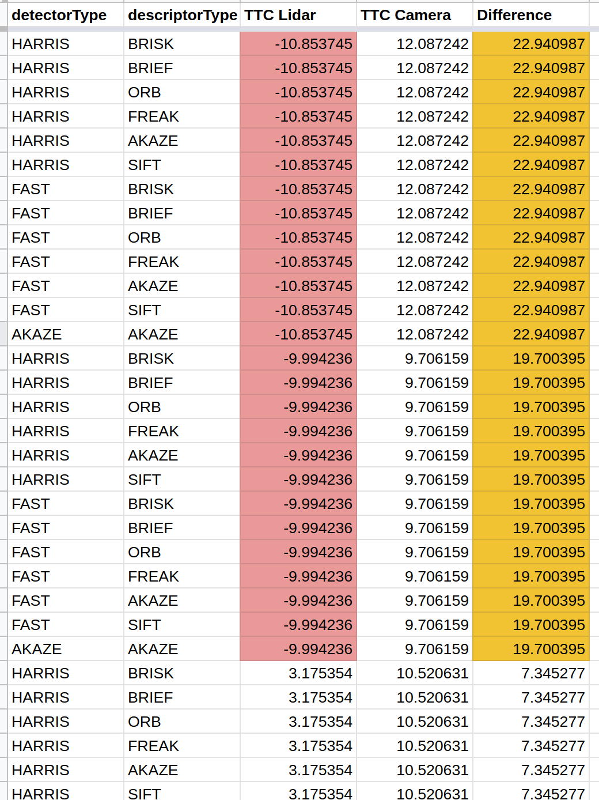
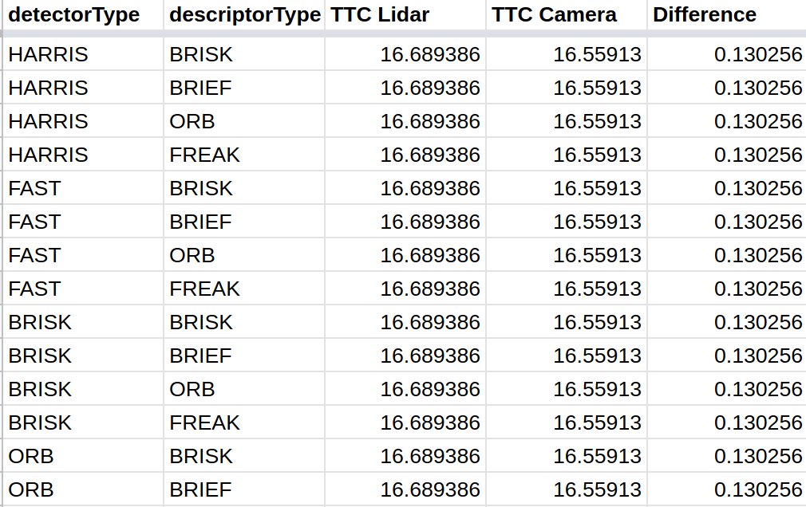
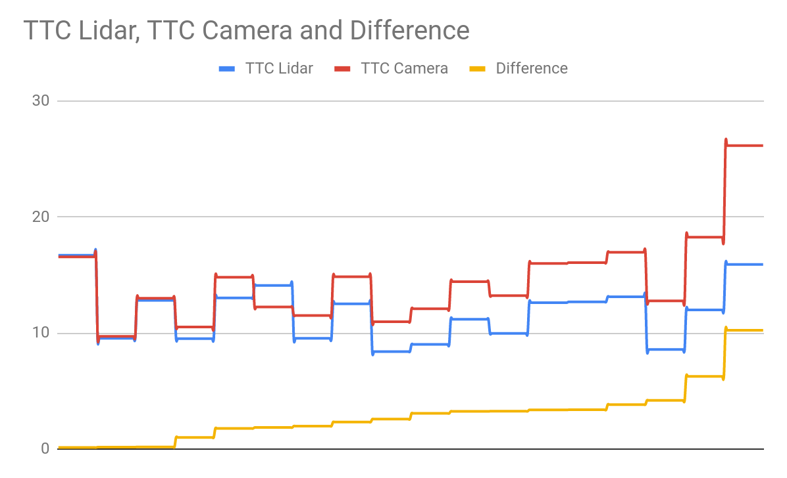
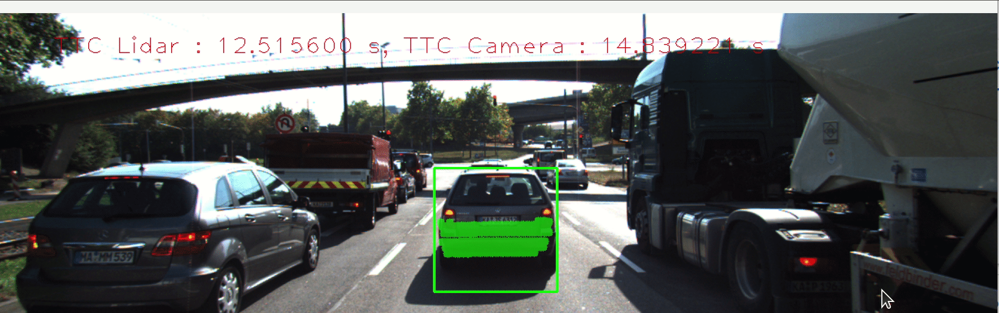

# SFND 3D Object Tracking

![Sensor-Fusion][1]
![Udacity][2]
![Computer-Vision][3]
![Open-CV][4]
![Yolo][5]
![Covid-19][6]

[1]: https://img.shields.io/:Sensor-Fusion-darkgreen.svg?style=round-square
[2]: https://img.shields.io/:Udacity-blue.svg?style=round-square
[3]: https://img.shields.io/:Computer-Vision-yellow.svg?style=round-square
[4]: https://img.shields.io/:Open-CV-purple.svg?style=round-square
[5]: https://img.shields.io/:Yolo-v3-p.svg?style=round-square
[6]: https://img.shields.io/:Covid-19-red.svg?style=round-square
---

## FP.1 Match 3D Objects

The purpose of this section is to match the bounding boxes between the successive frames to identify detected objects.
The idea behind the function is that, bounding boxes are compared by the matches, checking the keypoints that are enclosed the bounding boxes and storing them in a map.
This map is therefore contains the candidate matches.

Then I assoicate the bounding boxes with mode hightest occurance). Finally I return the map

```c++
void matchBoundingBoxes(std::vector<cv::DMatch> &matches, std::map<int, int> &bbBestMatches, DataFrame &prevFrame, DataFrame &currFrame)
{

    // multimap for previous and current frames
    multimap<int, int> boxesMap;

    for (auto match : matches)
    {

        cv::KeyPoint prevKP = prevFrame.keypoints[match.queryIdx];
        cv::KeyPoint currKP = currFrame.keypoints[match.trainIdx];

        int prevIdx, currIdx;
        // initialization
        prevIdx = currIdx = -1;

        prevIdx = getPrevBoxID(prevFrame, match);
        currIdx = getCurrBoxID(currFrame, match);
        boxesMap.insert({currIdx, prevIdx});
    }

    // now we have a map that contains boxes id in the current
    // frames and its correponding in the previous frame
    int currSize = currFrame.boundingBoxes.size();
    int prevSize = prevFrame.boundingBoxes.size();

    // let's find the best matches for each
    for (int i = 0; i < currSize; i++)
    {
        // https://en.cppreference.com/w/cpp/algorithm/equal_range
        auto similarBoxes = boxesMap.equal_range(i);
        // https://www.geeksforgeeks.org/initialize-a-vector-in-cpp-different-ways/
        vector<int> count(prevSize, 0);

        for (auto pair = similarBoxes.first; pair != similarBoxes.second; pair++)
        {
            if ((*pair).second != -1)
            {
                count[(*pair).second]++;
            }
        }

        bbBestMatches.insert({getMode(count), i});
    }
}

```
---

## FP.2 Compute Lidar-based TTC
This section is quite simple. As in the derivation, to get the TTC from the lidar, the equation applied is:
`TTC = d1*dT/(d0-d1)`
dT can be calculated easily from the frameRate (its recoprical). d1 and d0 are the Xs of the current and previous points respectively.

But to get rid of outliers, we get the median of the Xs. And that is used to substitute the equation.

Inside `getMedian` function I first sort the points based on the Xs, as it is our insterest here.


```c++
void computeTTCLidar(std::vector<LidarPoint> &lidarPointsPrev,
                     std::vector<LidarPoint> &lidarPointsCurr, double frameRate, double &TTC)
{
    // auxiliary variables
    double dT = 1 / frameRate; // time between two measurements in seconds
    //this is based on the horizontal FOV
    double laneWidth = 4.0; // assumed width of the ego lane

    double minXPrev = getMedian(lidarPointsPrev);
    double minXCurr = getMedian(lidarPointsCurr);

    // compute TTC from both measurements
    TTC = minXCurr * dT / (minXPrev - minXCurr);
    ...
}
```


## FP.3 Associate Keypoint Correspondences with Bounding Boxes


A pre-step for Computing TTC for the camera would be getting all the keypoint matches that belong to every object. And this is why `clusterKptMatchesWithROI` exists. I typically loop of the matches for both previous and current frames and check if they are included in the bound-box. If so, I append them to my map, and calculate the euclidean distance (as recommended by the instructor) to get the mean from.

To avoid outliers, I evaluted the mean and the standard deviation and checked for each element in my map if the match isn't deviated. Therefore, outliers are removed. I finally, return the inliers.

```c++
void clusterKptMatchesWithROI(BoundingBox &boundingBox, std::vector<cv::KeyPoint> &kptsPrev, std::vector<cv::KeyPoint> &kptsCurr, std::vector<cv::DMatch> &kptMatches)
{
    std::map<vector<cv::DMatch>::iterator, double> theMap;
    ..    
    
    // calc distances
    for (auto it = kptMatches.begin(); it != kptMatches.end(); it++)
    {
        auto &currKpt = kptsCurr[(*it).trainIdx];
        auto &prevKpt = kptsPrev[(*it).queryIdx];

        if (boundingBox.roi.contains(currKpt.pt))
        {
            
            theMap[it] = cv::norm(currKpt.pt - prevKpt.pt);
            euclideanDistances.push_back(cv::norm(currKpt.pt - prevKpt.pt));
        }
    }
    // calc mean
    double mean = calcMean(euclideanDistances);
    // calc stddev
    double stddev = calcStddev(mean, euclideanDistances);
    // for each distance, if it is below the threshold, push it
    for (auto const &pair : theMap)
    {
        if ((pair.second - mean) < stddev)
        {
            boundingBox.kptMatches.push_back(*pair.first);
        }
    }
}


```

## FP.4 Compute Camera-based TTC

The code used in this section is the same of exercise 3, with no major changes. Yet, let me explain the idea behind it.

Since bounding boxes do not always represent the actual size of the car, we use keypoints instead to explain the opposite objects. And as we use mono camera, we cannot not measure the speed but Time-to-Collision.

From the derivation, we only need delta T (difference in time between two successive frame) and distance ratio. (the derivation is a basic math and trignometry, so I neglect it)

As for dT, the time difference, it corresponding inversely to the frameRate (frequency)

After we calclate the distances ratio, we get its median. Why not mean? In case of outliers, mean is not the best measurement. Outliers may deviate the ratio badly.

```c++
void computeTTCCamera(std::vector<cv::KeyPoint> &kptsPrev, std::vector<cv::KeyPoint> &kptsCurr,
                      std::vector<cv::DMatch> kptMatches, double frameRate, double &TTC, cv::Mat *visImg)
{
    
    // compute distance ratios between all matched keypoints
    vector<double> distRatios; // stores the distance ratios for all keypoints between curr. and prev. frame
    for (auto it1 = kptMatches.begin(); it1 != kptMatches.end() - 1; ++it1)
    { // outer kpt. loop

        // get current keypoint and its matched partner in the prev. frame
        cv::KeyPoint kpOuterCurr = kptsCurr.at(it1->trainIdx);
        cv::KeyPoint kpOuterPrev = kptsPrev.at(it1->queryIdx);

        for (auto it2 = kptMatches.begin() + 1; it2 != kptMatches.end(); ++it2)
        { // inner kpt.-loop

            double minDist = 100.0; // min. required distance

            // get next keypoint and its matched partner in the prev. frame
            cv::KeyPoint kpInnerCurr = kptsCurr.at(it2->trainIdx);
            cv::KeyPoint kpInnerPrev = kptsPrev.at(it2->queryIdx);

            // compute distances and distance ratios
            double distCurr = cv::norm(kpOuterCurr.pt - kpInnerCurr.pt);
            double distPrev = cv::norm(kpOuterPrev.pt - kpInnerPrev.pt);

            if (distPrev > std::numeric_limits<double>::epsilon() && distCurr >= minDist)
            { // avoid division by zero

                double distRatio = distCurr / distPrev;
                distRatios.push_back(distRatio);
            }
        } // eof inner loop over all matched kpts
    }     // eof outer loop over all matched kpts

    // only continue if list of distance ratios is not empty
    if (distRatios.size() == 0)
    {
        TTC = NAN;
        return;
    }

    medianDistRatio = getMedianCam(distRatios);
    double dT = 1/frameRate;
    TTC = -dT/(1-medianDistRatio);

}


```


## FP.5 Performance Evaluation 1
Some results were illogical for the lidar. The time was negative. They reason for that is the existance of the outliers. However, some fixes helped. I have adjusted my computation based on the median, as suggested by the instuctor and mentioned in the aforementioned tasks.




---

## FP.6 Performance Evaluation 2

For better evaluation, a `writeLog` function is implemented to log all the data automatically in a CSV file

I logged all possible combinations, as I did in the mid-term project 
``` c++
    vector<string> detectors{"HARRIS", "FAST", "BRISK", "ORB", "SIFT", "SHITOMASI"};
    vector<string> descriptors{"BRISK", "BRIEF", "ORB", "FREAK", "SIFT"};
```
Also, tried `AZAKE` detector with `AKAZE` descriptor as they only work with each other.

After gathering data into the CSV file, sorting them was crucial. I sorted the csv based on the difference between Lidar-TTC and Camera-TTC (assumed accurate calculations have small differences) 



> the CSV is attached with the report

The Top 3:
1. HARRIS - BRISK
1. HARRIS - BRIEF
1. HARRIS - ORB




---
